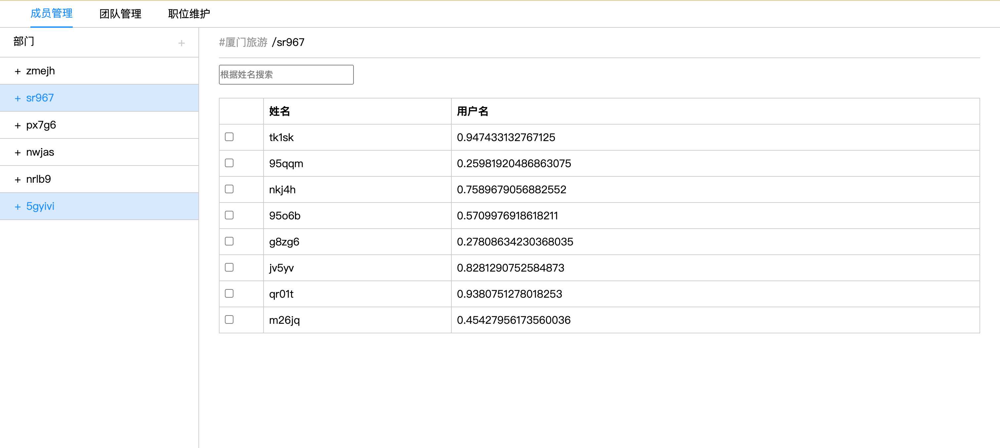

# Hixtrip FE Online

## 准备

- fork 此仓库
- 根据如下要求实现相关代码
- 完成要求
  - 提交`pull request`
  - 提供页面截图

## 需求

1. 目前已经有`src/api/user.ts` 以及 `src/api/org.ts` 两个 API
2. 需要实现如下效果界面：


## 实现效果(没有使用ui库)


> 功能要求：

- 不限 ```React``` 或者 ```Vue```
- 需要拆分 `OrgTree` 以及 `UserTable` 两个组件
  - 两个组件自己维护相关的数据。
  - 体现两个组件的互相通信。
- 组织架构根据点上级节点进行查询子级节点实现异步加载。
- 用户 ```Table``` 数据跟据点击 ```组织架构树形节点``` 以及 ```输入搜索关键字``` 查询。
  - 需要考虑防抖节流等功能点
- 风格不限
  - 示例图仅仅是效果展示，不需要完全符合。
  - 可以使用 ```UI Framework```, 如 ```ant-design```, ```element-ui```等
  - 如果不用```UI Framework```, 可以直接用原生的```<ul> <li>```, ```<table>``` 实现，不用实现相关的CSS样式, 可以加分。

## 其他简答题

### 如何将如下的`JSON`正确解析成 `Object`

```json
{
  "userId": 111323290434354540545
}
```

## 答案

```
const jsonStr = '{"userId": 111323290434354540545}';
const jsonObj = JSON.parse(jsonStr);

console.log(jsonObj);

```

### 前端需要*稳定*每隔`1s`向服务端请求`API`, 请问如何实现？

```
##答案

function fetchData() {
  fetch('https://xxxx')
    .then(response => {
      return response.json();
    })
    .then(data => {
      // 处理从服务端获取的数据
      console.log(data);
    })
    .catch(error => {
      // 处理请求错误
      console.error(error);
    });
}

// 每隔1秒执行一次 fetchData 函数
setInterval(fetchData, 1000);
```

### 什么情况下，你会为你的项目引入状态管理库，比如`Redux`, `Pinia`, 可以简述一下起到了什么作用么？

```
1:跨组件通信，
2:多个组件共享一个状态
3:大项目数据驱动，方便管理维护数据

```

### 为什么`ESM`与`CJS`不能兼容？

```
1:ESM 使用 import 和 export导入和导出模块,而CJS 使用 require() 和 module.exports 或 exports 来导入和导出模块
2:ESM是浏览器的标准，而CJS是通过node.js的
3:ESM 在代码执行前会进行静态分析，CJS 在运行时动态加载模块
```
